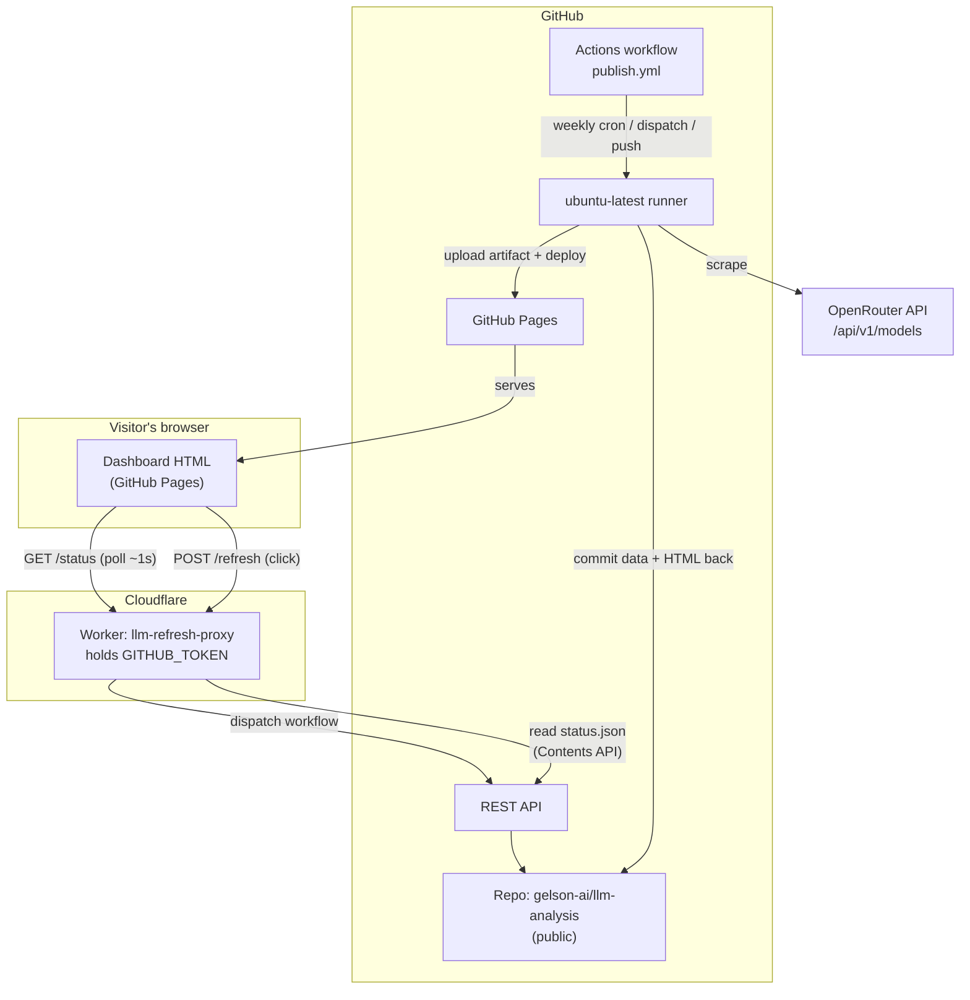

# Deployment Architecture

How the OpenRouter price-vs-performance dashboard is built, published, and
refreshed in production — including the design decisions, the verified timings,
and the failure modes that were found the hard way.

> **Status:** live and verified end-to-end.
> Dashboard: <https://gelson-ai.github.io/llm-analysis/>
> Refresh proxy: `https://llm-refresh-proxy.gelson-a26.workers.dev/`

---

## 1. What this is

Two things that used to be one:

1. **A Python data pipeline** (`run_pipeline.py` + `src/`) that scrapes
   `https://openrouter.ai/api/v1/models`, normalizes it, and writes JSON/CSV
   into `data/`.
2. **A dashboard** — a single self-contained HTML file built from that data by
   `dashboard/build_dashboard.py`.

In production neither runs on anyone's machine. The scrape happens on GitHub's
runners, the HTML is served by GitHub Pages, and a small Cloudflare Worker lets
any visitor trigger a refresh on demand without ever seeing a credential.

**Total running cost: $0.** Unlimited Actions minutes (public repo), free
GitHub Pages, and the Cloudflare Workers free tier.

---

## 2. Architecture at a glance



**The one rule that shapes everything:** the dashboard is a *static file*. It
cannot rewrite data or republish itself. Every dynamic behaviour is either a
scheduled CI job or a Worker call.

---

## 3. Components

| Component | What it does | Where it lives |
| --- | --- | --- |
| **Data pipeline** | Scrapes OpenRouter, normalizes, writes `data/**` | `run_pipeline.py`, `src/**` |
| **Dashboard build** | Renders `data/**` into one self-contained HTML file | `dashboard/build_dashboard.py`, `dashboard/template.html` |
| **Refresh orchestrator** | Fetch → lock weekly picks → rebuild, as one command | `dashboard/refresh.py` |
| **Weekly picks** | Locks one "Model of the Week" per metric, Monday–Sunday | `dashboard/weekly_picks.py`, `data/analysis/weekly_picks.json` |
| **CI workflow** | Runs the refresh, commits results, publishes Pages | `.github/workflows/publish.yml` |
| **Static host** | Serves the built HTML publicly over HTTPS | GitHub Pages |
| **Refresh proxy** | Holds the GitHub token; exposes `/status` + `/refresh` | `cloudflare-worker/worker.js` |
| **Credential** | Fine-grained PAT, one repo, `Actions: read+write` | Cloudflare Worker secret `GITHUB_TOKEN` |
| **Local dev server** | Serves the same HTML + endpoints on loopback | `dashboard/serve.py` |

**`dashboard/refresh.py` is deliberately untouched by this deployment.** It was
written as a standalone CLI precisely so CI could call the identical command.
Nothing about it changed.

---

## 4. Data flows

### 4.1 Weekly scheduled refresh

Fires on cron `0 0 * * 1` (UTC), i.e. **Monday 08:00 Asia/Manila**.

```
cron → checkout → install deps → pytest → refresh.py --max-age-hours 192
     → commit data/** + dashboard/** as github-actions[bot]
     → stage _site/index.html + _site/status.json
     → configure-pages → upload artifact → deploy Pages
```

`refresh.py` internally does three things in order:

1. `run_pipeline.py` — the network fetch. **If this fails, the run aborts
   without rebuilding**, so a bad scrape can never replace a good dashboard.
2. Lock this week's picks for any metric not yet locked.
3. `build_dashboard.py` — republish the HTML.

The bot commit uses the built-in `GITHUB_TOKEN`, and **commits made with
`GITHUB_TOKEN` do not re-trigger workflows** — so there is no loop. Pages is
deployed later in the same job rather than by a separate workflow.

### 4.2 On-demand refresh (the "Refresh data" button)

```
visitor clicks
  → POST https://llm-refresh-proxy…workers.dev/refresh   (Origin: gelson-ai.github.io)
  → Worker validates Origin, checks cooldown + single-flight
  → POST /repos/…/actions/workflows/publish.yml/dispatches   → 204
  → Worker replies 202; page shows "Refreshing…" and polls /status every 1.5s
  → run completes → /status returns state "ok" with a new finished_at
  → page reloads itself and shows the updates
```

**Measured, not estimated:** click → fresh published data in **~37 seconds**
(clicked 04:26:10Z, new data retrieved 04:26:33Z, run finished 04:26:47Z).

### 4.3 Push-triggered republish

A push to `main` touching `dashboard/**`, `data/**`, `src/**`, `config/**`,
`requirements.txt`, or the workflow file itself republishes the site — but
**skips the scrape**. Re-scraping on every commit would waste API calls and
could hit the freshness gate with committed data.

---

## 5. Refresh button API contract

The Worker deliberately mirrors `dashboard/serve.py`'s response shapes, so
`template.html` needed only a base-URL change.

`GET /status`

```json
{
  "ok": true,
  "data": {
    "retrieved_at": "2026-09-12T04:26:33Z",
    "age_hours": 0.01,
    "stale": false,
    "model_count": 445
  },
  "job": {
    "state": "idle",
    "started_at": null,
    "finished_at": null,
    "result": null,
    "cooldown_seconds": 600,
    "retry_after_seconds": 0
  }
}
```

`job.state` ∈ `idle | running | ok | failed`.

`POST /refresh` → `202` accepted · `409` already running · `429` cooldown (with
`Retry-After`) · `403` foreign origin · `502` GitHub rejected the dispatch.

`GET /healthz` → `{"ok":true}` — liveness only, needs no token.

**Client base-URL resolution** (in `dashboard/template.html`):

```js
const REFRESH_API = (location.hostname === "localhost" ||
                     location.hostname === "127.0.0.1")
  ? "/api"                                        // serve.py's routes
  : "https://llm-refresh-proxy.gelson-a26.workers.dev";
```

Both contexts then use `${REFRESH_API}/status`, so **local development through
`serve.py` keeps working unchanged.**

---

## 6. Security model

| Concern | Mitigation |
| --- | --- |
| Token must never reach the browser | Held only as a Worker secret; the page has no credential and POSTs no auth header |
| Token scope | Fine-grained PAT, **only** `gelson-ai/llm-analysis`, **only** `Actions: read+write` |
| Abuse of a public refresh button | 600 s cooldown + single-flight; the Worker rejects a second dispatch |
| Other sites driving the Worker | CORS locked to `https://gelson-ai.github.io`; `POST` requires an **exact** Origin match, and a missing Origin is rejected too |
| API rate-limit exhaustion | `/status` cached 5 s; otherwise ~10 open tabs would burn tens of thousands of GitHub API calls/hour against a 5,000 limit |
| Credential in the repo | `.gitignore` excludes `.env*`; the token exists only in Cloudflare |
| Blast radius if leaked | One repo, Actions only — no code write, no data read beyond what's public. Rotating takes ~20 s |

**Not protected (deliberate, per requirements):** anyone can press Refresh. The
cooldown is the only brake. See §10 for how to tighten it.

---

## 7. Configuration reference

### Workflow — `.github/workflows/publish.yml`

| Setting | Value |
| --- | --- |
| Triggers | `schedule` `0 0 * * 1`, `workflow_dispatch`, `push` to `main` (path-filtered) |
| Permissions | `contents: write`, `pages: write`, `id-token: write` |
| Concurrency | group `publish-dashboard`, `cancel-in-progress: false` |
| Timeout | 15 minutes |
| Refresh flag | `--max-age-hours 192` |
| Runner | `ubuntu-latest`, Python 3.12, pip cache |

### Worker — `cloudflare-worker/worker.js`

| Constant | Default | Effect |
| --- | --- | --- |
| `ALLOWED_ORIGIN` | `https://gelson-ai.github.io` | Only origin allowed to drive the Worker |
| `COOLDOWN_SECONDS` | `600` | Minimum gap between refreshes |
| `RECENT_COMPLETION_SECONDS` | `900` | How long a finished run counts as "the job" |
| `STATUS_CACHE_SECONDS` | `5` | `/status` cache lifetime |
| `STALE_AFTER_HOURS` | `192` | When data is flagged stale (weekly cadence + headroom) |
| `REFRESH_EVENTS` | `workflow_dispatch`, `schedule` | Runs that count as a data refresh |

### Dependencies — `requirements.txt`

**Pinned exactly** (`requests==2.34.2`, `pytest==9.1.1`). With `>=` ranges CI
would install whatever PyPI released most recently — not what was verified
locally — so the test gate could fail for reasons unrelated to this repo.

---

## 8. First-time setup (reproduce from scratch)

1. **Create a public GitHub repo** and push the code.
   Public is required: GitHub Pages won't publish from a private repo on a free
   account, and public repos get unlimited Action minutes.
2. **Create `.gitignore` first** — exclude `.venv/`, caches, `logs/`,
   `data/analysis/.refresh.lock`. Do **not** exclude `data/**` or
   `dashboard/price_performance_final.html`; those are the artifact and the
   history. Verify with `git ls-files --cached | findstr /i venv` (must be empty).
3. **Enable Pages:** Settings → Pages → Source = **"GitHub Actions"**.
   Must be done by hand — see §10.1.
4. **Verify the account's email is verified** (github.com/settings/emails).
   An unverified email can prevent a Pages site from publishing.
5. **Push the workflow**, then run it once manually from the Actions tab to
   produce the first published dashboard.
6. **Create a fine-grained PAT:** <https://github.com/settings/personal-access-tokens/new>
   → only this repo → **Actions: Read and write** → nothing else.
7. **Create the Cloudflare Worker** from the *"Start with Hello World!"*
   template, **not** "Continue with GitHub". Paste `cloudflare-worker/worker.js`.
8. **Add the token:** Worker → Settings → Variables and Secrets → Add →
   type **Secret** → name `GITHUB_TOKEN`.
9. **Point the dashboard at it:** set `REFRESH_API` in `dashboard/template.html`,
   rebuild, commit, push.

---

## 9. Operations runbook

### 9.1 Health checks

```bash
# Worker alive (no token needed)
curl https://llm-refresh-proxy.gelson-a26.workers.dev/healthz
#   → {"ok":true}

# Full status: data freshness + job state
curl https://llm-refresh-proxy.gelson-a26.workers.dev/status
#   → {"ok":true,"data":{...},"job":{"state":"idle",...}}
#   → "not_configured" means the GITHUB_TOKEN secret is missing

# Foreign origin must be refused
curl -i -X POST -H "Origin: https://evil.example.com" \
  https://llm-refresh-proxy.gelson-a26.workers.dev/refresh
#   → 403

# The real thing
curl -i -X POST -H "Origin: https://gelson-ai.github.io" \
  -H "Content-Type: application/json" -d '{}' \
  https://llm-refresh-proxy.gelson-a26.workers.dev/refresh
#   → 202, then 429 if repeated within 10 minutes

# Is the data actually fresh? (add ?cb=<random> to dodge caches)
curl "https://gelson-ai.github.io/llm-analysis/status.json?cb=1"
```

Locally, before pushing a change to the build:

```powershell
.\.venv\Scripts\python.exe .\dashboard\build_dashboard.py
.\.venv\Scripts\python.exe -m pytest tests/ -q      # 59 tests, fully offline
```

### 9.2 Failure modes

| Symptom | Likely cause | Fix |
| --- | --- | --- |
| Button says *"Cannot reach the refresh service"* | Worker deleted/renamed, or URL in `template.html` is stale | Check `/healthz`; fix `REFRESH_API`; rebuild |
| `/status` returns `not_configured` | `GITHUB_TOKEN` secret missing | Re-add it in Cloudflare |
| `/status` returns `502 status_unavailable` | Token expired or lost its permissions | Rotate the token (§9.3) |
| Button says *"next refresh available in Ns"* for 10 min | Cooldown — expected after any refresh run | Wait, or lower `COOLDOWN_SECONDS` |
| POST returns `403 forbidden_origin` | Page served from an origin other than `ALLOWED_ORIGIN` | Update the constant and redeploy the Worker |
| Weekly refresh never commits | Workflow disabled after ~60 days of repo inactivity, or a failing test | Check the Actions tab; re-enable; read the log |
| Workflow fails at *Run tests* | A dependency or code change broke a test | Reproduce locally with `pytest` |
| Workflow fails at *Configure Pages* | Pages not enabled, or set to "Deploy from a branch" | Settings → Pages → Source = "GitHub Actions" |
| Site shows old data after a successful run | GitHub Pages CDN (can lag minutes) | Re-check shortly; not a fault |
| `git push` rejected, `behind 1` | The workflow committed to the remote; your clone is stale | `git pull --rebase origin main`, then push |

### 9.3 Rotating the GitHub token

The PAT expires (a 90-day expiry is typical). **When it lapses, both the button
and the Monday scrape stop — the dashboard silently stops updating.** This is
the single most likely future breakage; put a reminder somewhere.

1. Create a replacement PAT (same settings: one repo, `Actions: read+write`).
2. Cloudflare → `llm-refresh-proxy` → Settings → Variables and Secrets →
   edit `GITHUB_TOKEN` → paste the new value → Save/Deploy.
3. Confirm with `curl …/status` — a `502` means it still isn't right.
4. Revoke the old token on GitHub.

No code changes and no redeploy of the dashboard are needed.

### 9.4 Changing the schedule

Edit the cron in `.github/workflows/publish.yml`. Cron is **UTC**.

| Desired (Asia/Manila, UTC+8, no DST) | Cron |
| --- | --- |
| Monday 08:00 | `0 0 * * 1` |
| Monday 06:00 | `0 22 * * 0` |
| Daily 08:00 | `0 0 * * *` |

GitHub's scheduler is best-effort — expect a few minutes' drift under load.

---

## 10. Known limitations & gotchas

These were all discovered by testing, not by reading documentation. They are
recorded here so they aren't re-learned.

1. **`GET /repos/{owner}/{repo}/pages` returns 404 when unauthenticated even
   when Pages *is* enabled.** It looks like a definitive check and isn't. The
   reliable signal is the `has_pages` field on the repository object.
2. **`actions/configure-pages`' `enablement: true` cannot work here.** Its
   `action.yml` states it "requires a token other than `GITHUB_TOKEN`" (a PAT or
   GitHub App). Enabling Pages is therefore a manual one-time click. The
   alternative would be putting a broad PAT in Actions secrets to save one
   dropdown — not worth the privilege.
3. **Push-triggered runs must not count as data refreshes.** Treating every
   recent run as "the job" disabled the button for 10 minutes after *every
   commit* and made each new visitor auto-reload once. Hence `REFRESH_EVENTS`.
4. **`raw.githubusercontent.com` is CDN-cached** and can serve a stale
   `status.json` for minutes after a deploy, which would make the button
   misreport data age. The Worker reads it through the GitHub **Contents API**.
5. **The `.refresh.lock` file only guards one machine.** Two runners have
   separate filesystems, so the workflow's `concurrency` group is the real
   guard against two refreshes interleaving and locking conflicting picks.
6. **Freshness gate mismatch:** `build_dashboard.py` refuses to build data older
   than 72 h by default, but a weekly cadence is 168 h. The workflow passes
   `--max-age-hours 192`. A fetch-then-build run always passes anyway; this is
   headroom.
7. **`git add -A` is not selective.** Ignore rules must exist *before* the first
   commit — removing a large binary from history afterwards means a rewrite.
8. **GitHub's Actions API lags** ~1 minute before a new run appears in
   `/actions/runs`.
9. **Commits made with `GITHUB_TOKEN` do not trigger workflows** — this prevents
   a loop, but it also means a separate "deploy on push" workflow would never
   fire from the bot commit. Hence deploy-in-the-same-job.
10. **Your local clone goes stale.** The workflow commits to `main`, so
    `git push` can be rejected with `behind 1`. Always `git pull --rebase` first.
11. **Don't use Cloudflare's "Continue with GitHub" / "Connect to Git" path**
    for this Worker. It creates a *Workers Build* that fails on every push
    because there's no `wrangler.toml` at the repo root (ours is in
    `cloudflare-worker/`). A stray Worker from that path may still exist and
    show failing builds.
12. **`on:` parses as boolean `True` in PyYAML.** `yaml.safe_load(...)["on"]`
    raises `KeyError`; use `[True]`. Not a workflow bug.
13. **GitHub disables scheduled workflows after ~60 days of repository
    inactivity.** The weekly bot commit counts as activity, so this should
    self-sustain — but if the schedule ever stops for no reason, check here.
14. **Token expiry is silent.** Nothing warns you; the dashboard just stops
    updating. See §9.3.

---

## 11. Cost

| Service | Tier | Notes |
| --- | --- | --- |
| GitHub repo | Free, public | Unlimited Actions minutes on public repos |
| GitHub Pages | Free | Public repos only, on a free account |
| Cloudflare Workers | Free | 100k requests/day; `/status` caching keeps usage tiny |
| OpenRouter API | Free | `GET /api/v1/models` needs no key |

Private repos would change this: Pages needs GitHub Pro, and Actions drops to
2,000 minutes/month.

---

## 12. File map

```
.github/workflows/publish.yml     CI: refresh + commit + deploy Pages
cloudflare-worker/worker.js       Refresh proxy (the only credential holder)
cloudflare-worker/wrangler.toml   Config for optional CLI deploys
cloudflare-worker/README.md       Worker setup + curl checks

dashboard/template.html           THE hand-edited UI file; holds REFRESH_API
dashboard/build_dashboard.py      Renders template + data → HTML and status.json
dashboard/refresh.py              fetch → lock picks → rebuild (called by CI)
dashboard/weekly_picks.py         Monday–Sunday pick locking (UTC+8)
dashboard/serve.py                Local-only dev server (loopback)
dashboard/price_performance_final.html   GENERATED — never hand-edit
dashboard/status.json             GENERATED — data freshness sidecar

data/normalized/*.json|csv        CHAT pipeline output (tracked; drives the dashboard).
                                  The media pipeline writes into this same directory
                                  (image_models, video_models, media_benchmarks,
                                  media_prompt_benchmarks) but those files are NOT read
                                  by the dashboard - never assume *.json here is chat data.
data/analysis/weekly_picks.json   Weekly pick history (tracked)
data/analysis/media_*_report.json Media coverage + data-quality reports (tracked)
data/snapshots/<date>/            CHAT snapshots: one per day (tracked)
data/media_snapshots/<date>/      MEDIA snapshots: deliberately a SEPARATE top-level
                                  directory - see the note below
data/analysis/.refresh.lock       Machine-local runtime lock (IGNORED)

DEPLOYMENT.md                     This document
requirements.txt                  Pinned runtime + test dependencies
```

> **The media pipeline is not part of this deployment.** `run_media_pipeline.py`
> (image/video generation catalogs, pricing and benchmarks) is a second, manually
> run pipeline. It is deliberately absent from `dashboard/refresh.py`,
> `run_weekly.bat` and the CI workflow above, so nothing here fetches it on a
> schedule and no deployment component can fail because of it.
>
> Two consequences worth knowing:
>
> - Its snapshots live in **`data/media_snapshots/`**, not `data/snapshots/`.
>   That separation is load-bearing: `snapshot_exists_for()` in
>   `dashboard/refresh.py` infers "today's chat snapshot already ran" from
>   nothing more than a directory named `<date>` (or `<date>-N`) under
>   `data/snapshots/`, so a media snapshot written there would silently suppress
>   that day's real chat snapshot. Locked in by
>   `tests/test_media_snapshot_paths.py`.
> - The CI step `git add -A data dashboard` will pick up media outputs **if** a
>   media run has been committed, but it never generates them itself.

---

## 13. Design decisions log

| Decision | Why |
| --- | --- |
| Static site + CI, no always-on server | Free, and the PC can be off |
| Reuse `refresh.py` unchanged in CI | It already sequence-guards fetch→build and aborts without republishing on a failed fetch |
| Deploy Pages in the same job as the refresh | `GITHUB_TOKEN` commits don't re-trigger workflows |
| Concrete `concurrency` group, no cancel | Prevents two runs locking conflicting weekly picks; never kills a run mid-commit |
| Test step blocks the weekly refresh | A wrong block is loud and re-runnable; a wrong publish is silent and public |
| Skip the scrape on `push` | Committed data may be old, and an API call per commit is wasteful |
| Worker mirrors `serve.py`'s contract | Keeps `template.html` changes to a single constant |
| Short `/status` cache | The page polls ~1/s; uncached, ten tabs would exhaust the API limit |
| `REFRESH_API` = `/api` locally, Worker URL in public | Local `serve.py` development keeps working |
| Fine-grained PAT, one repo, Actions only | Smallest blast radius; rotation is ~20 seconds |
| Token in a Cloudflare **Secret**, never in git | A credential in the browser is readable by every visitor |

---

## 14. Verification history

Recorded so "it works" is a claim with evidence.

| Check | Result |
| --- | --- |
| Push run (`event: push`) | ✅ success, 25 s; scrape correctly **skipped** |
| Manual dispatch (`workflow_dispatch`) | ✅ success, 38 s; scrape ran; 437 → 445 models |
| Weekly pick across a mid-week refresh | ✅ pick unchanged; `weekly_picks.json` diff was **1 line** (`updated_at` only) |
| Snapshot policy in CI | ✅ `data/snapshots/2026-09-12/` created (5 files) |
| `.refresh.lock` in CI | ✅ not committed |
| Real button click, browser → Worker → GitHub | ✅ run #4, `event: workflow_dispatch` |
| Click → fresh published data | ✅ **~37 s** |
| Live `status.json` after the run | ✅ same new `retrieved_at` |
| Weekly pick across a *user-triggered* refresh | ✅ still "Z.ai: GLM 5.3 Flash", locked 11 Sep 03:09 PHT |
| Test suite | ✅ 59 passed, offline |
| Worker syntax | ✅ `node --check`, exit 0 |
